<h1 align="center">Development by <a href="https://github.com/DenisKhudyakov/drf_course_paper" target="_blank">Denis Khudyakov</a> 
</h1>


<h3>Тендерная площадка</h3>
<p>Разработано специально для компании ООО "ЧЗМЭК"</p>


	Установка и запуск:
		1) Установите Python и Poetry если они не установлены.
		2) Клонируйте репозиторий git clone https://github.com/DenisKhudyakov/tender_platform.git
		3) Установаите Docker и Docker Desktop
        4) Запустите в директории проекта команду docker compose up --build

<h2>Руководство пользователя.</h2>

<h3>Для поставщиков:</h3>

Для начала пользования зарегистрируйтесь на площадке
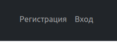 

Для Сотрудников только электронная почта и пароль<br>
Для Поставщиков при регистрации заполняются все поля 

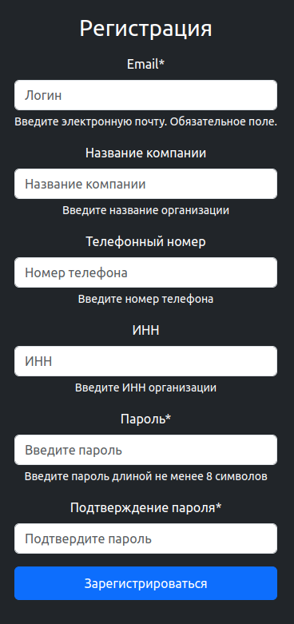

После успешной регистрации, вас попросят ввести ваш логин пароль для авторизации.<br>
Вы их вводите и попадаете на Страницу со списком заявок для поставщиков.<br>

На главной странице список заявок, в каждую заявку можно перейти и посмотреть список товаров в ней
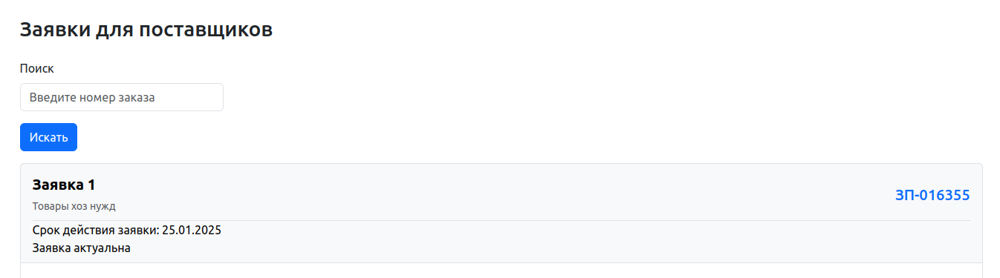
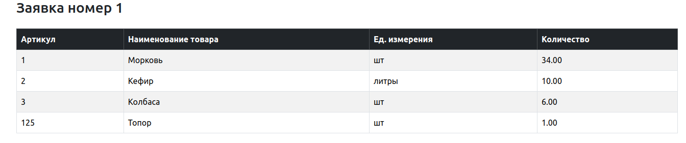

Вы можете ответить на эту заявку, если вы ранее уже отвечали, то программа предложит Вам обновить ответ на заявку.

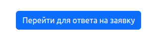
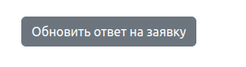

Ответ на заявку:
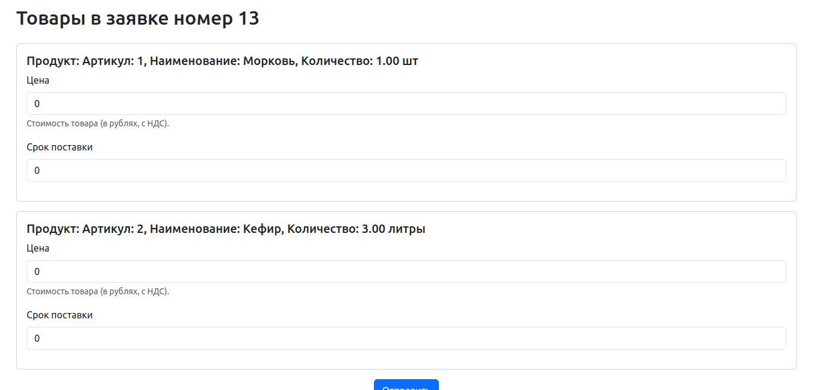
Если Поставщик не может дать предложение на какой-либо товар, необходимо оставить значение поля нулевым.

Обновление:
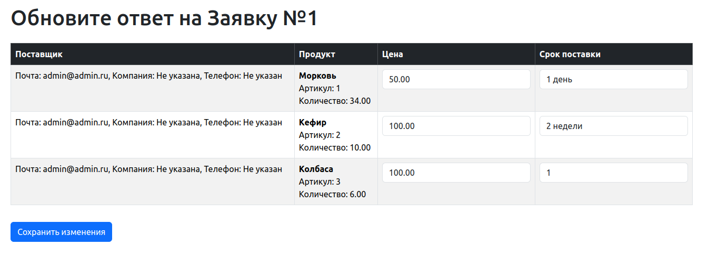

<h3>Для Сотрудников:</h3>

После регистрации и авторизации обратитесь к администратору.

Он проставит признак, что Пользователь является сотрудником и для Вас проявится дополнительный интерфейс
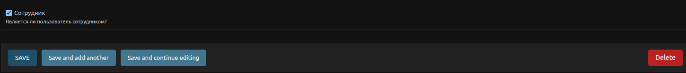

Вы сможете создавать товары, при необходимости:

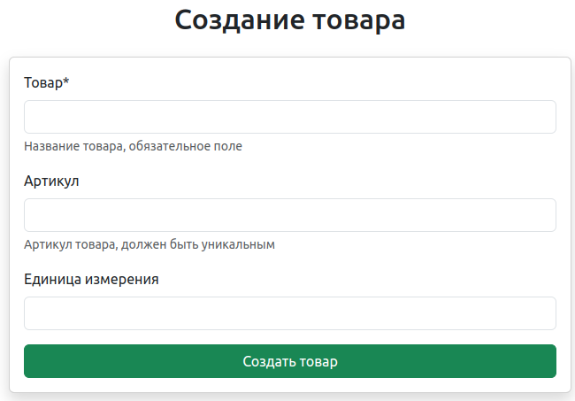

Создавать заявку.<br>
Так же реализовано API создания заявки из 1С, которая будет сразу же наполнена необходимыми товарами.

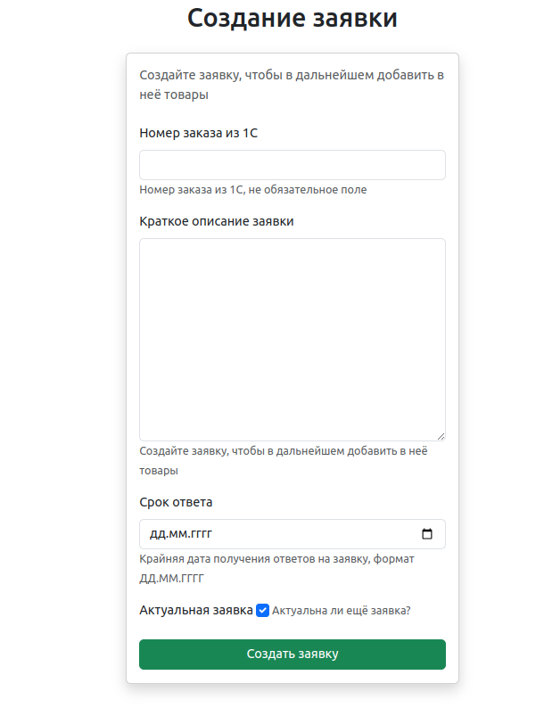

**Тестовые данные для создания заявки из 1С**
```angular2html

    {
    "products": [
        {"article": "12345", "name": "Product A", "measurement": "шт"},
        {"article": "67890", "name": "Product B", "measurement": "кг"}
    ],
    "amounts": [10, 20],
    "number_ERP": "ERP12345",
    "description": "Закупка товаров для проекта",
    "duration": "2024-12-31",
    }
```

Интерфейс Сотрудника:

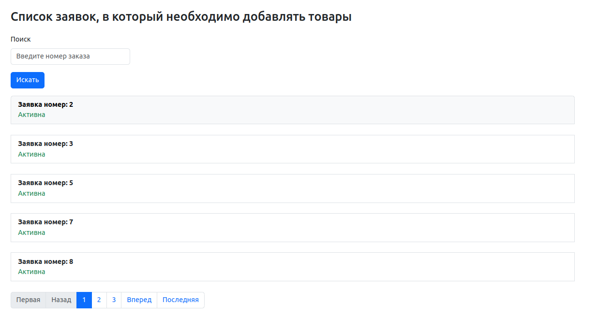

При переходе в какую либо заявку, Сотрудник может добавить товары в заказ, при необходимости,<br>
Просмотреть анализ цен, и обновить данные по заявке, например увеличить срок ответа или сделать её НЕ актуальной.

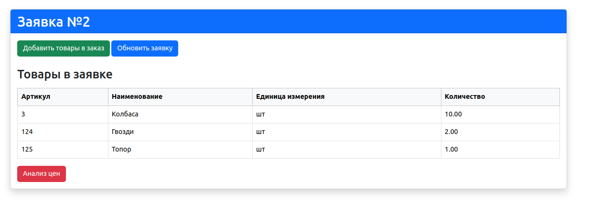

Обновление заявки:

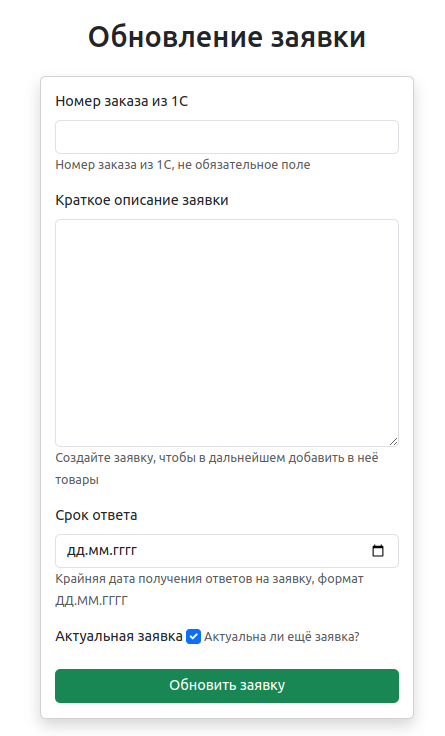


Анализ цен, в котором выгружены все ответы поставщиков по каждому товару, наиболее низкая цена за конкретный товар выделена зеленым.
Группировка в таблице по товарам. Для удобства реализован фильтр по конкретному товару в этой заявке.

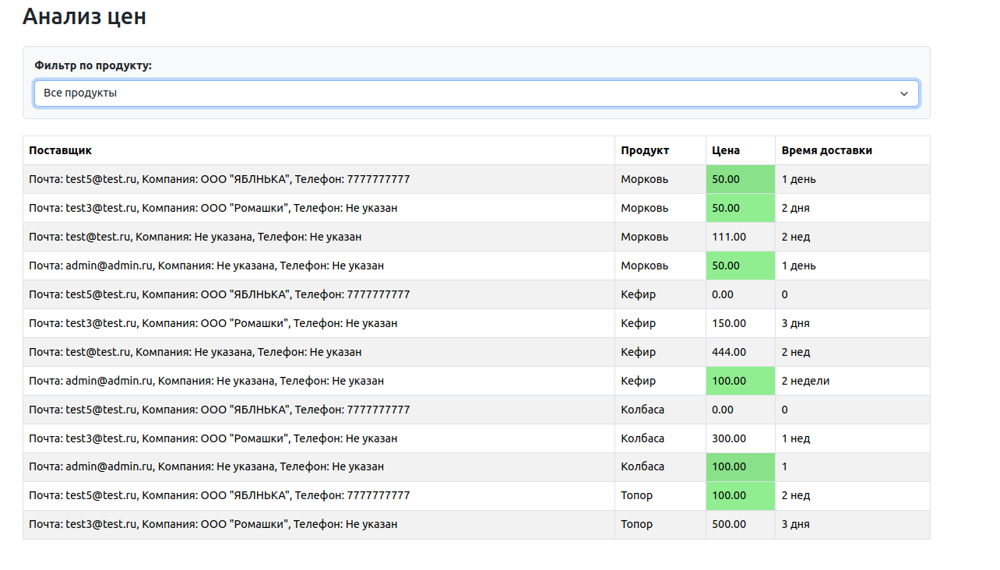

Работа фильтра. Если значение товара от поставщика нулевое, значит он не ответил на этот товар(нет вналичии и т.п.)

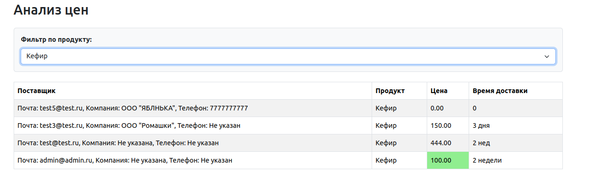
		